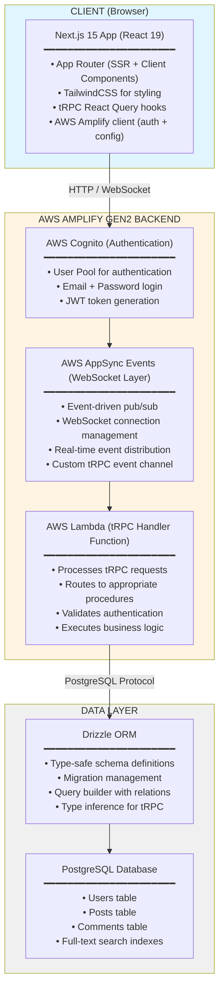
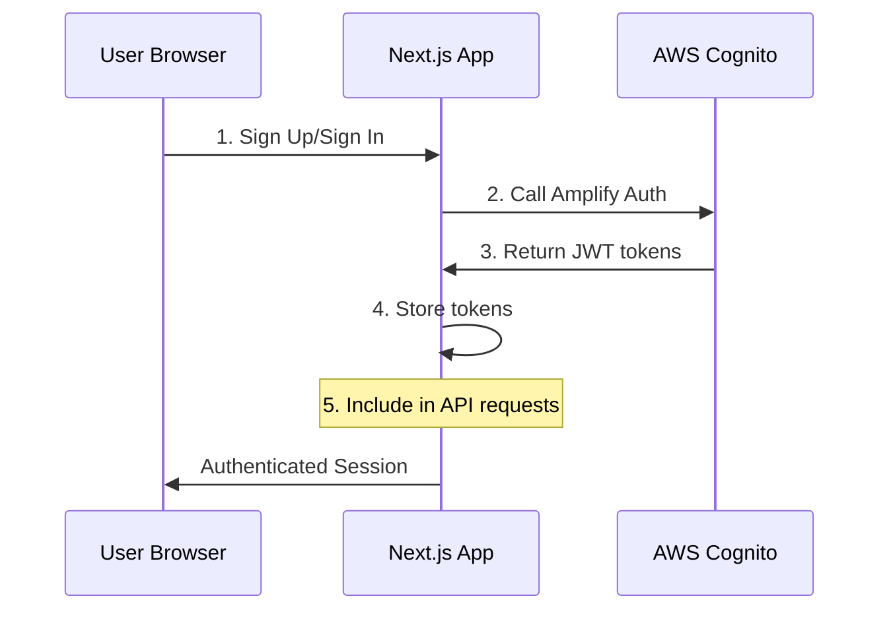
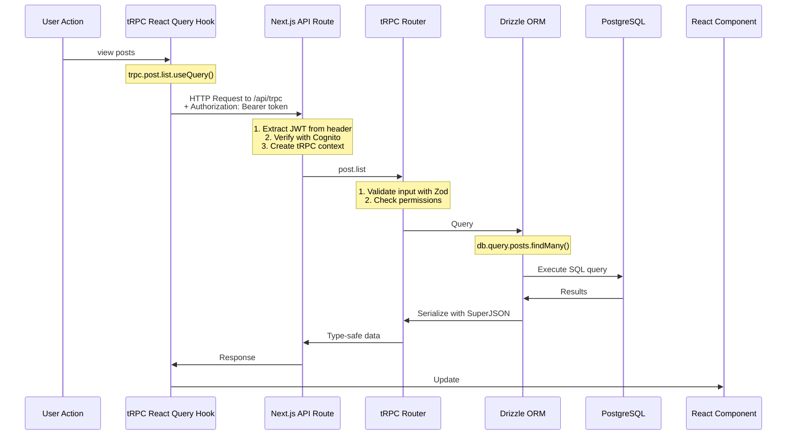
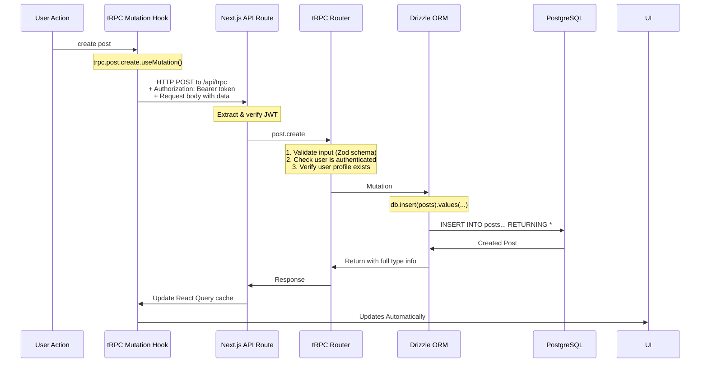
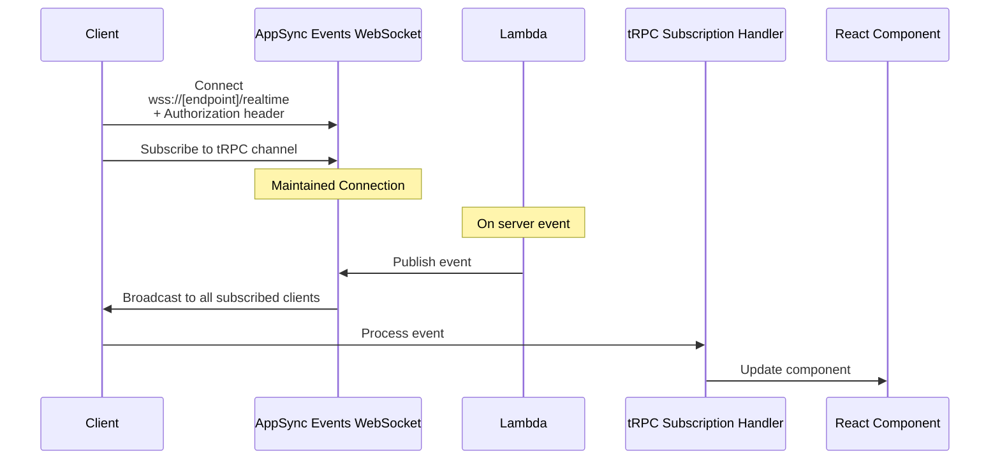
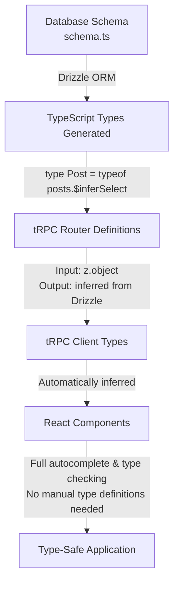
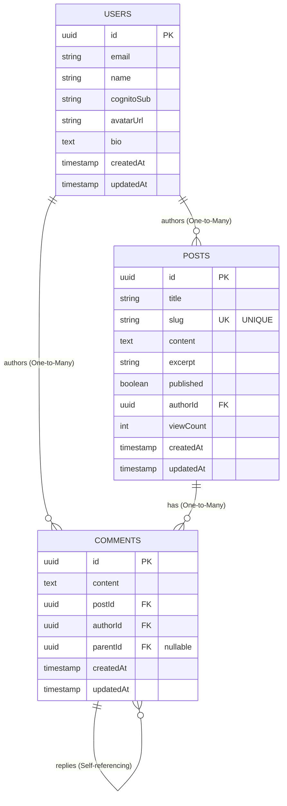

# Architecture Overview

## System Architecture

## Request Flow

### 1. Authentication Flow

### 2. Query Flow (Read Operations)

### 3. Mutation Flow (Write Operations)

### 4. WebSocket Flow (Prepared for Real-time)

## Type Safety Flow

## Data Model (Drizzle Schema)

## Security Layers

### 1. Network Security
- HTTPS/WSS encryption for all traffic
- VPC for database (optional)
- Security groups for AWS resources

### 2. Authentication
- AWS Cognito JWT tokens
- Token validation on every request
- Automatic token refresh

### 3. Authorization
- tRPC context includes authenticated user
- Protected procedures check user identity
- Row-level security in procedures (author checks)

### 4. Input Validation
- Zod schemas validate all inputs
- SQL injection prevention via Drizzle parameterization
- XSS protection in React (automatic escaping)

### 5. Rate Limiting (To Implement)
- API Gateway throttling
- Lambda concurrency limits
- Application-level rate limiting

## Scalability Considerations

### Horizontal Scaling
- **Lambda**: Automatically scales to handle requests
- **Next.js**: Deploy to multiple regions with Vercel
- **Database**: Add read replicas for queries

### Vertical Scaling
- **Database**: Upgrade instance size as needed
- **Lambda**: Increase memory allocation (increases CPU)

### Caching Strategy
- **React Query**: Client-side caching (5s stale time)
- **CDN**: Static assets cached at edge
- **Database**: Add Redis for frequently accessed data

### Connection Pooling
- **Drizzle**: Reuse connections in Lambda
- **PgBouncer**: Pool connections to PostgreSQL

## Monitoring & Observability

### AWS CloudWatch
- Lambda execution logs
- Error tracking and alarms
- Performance metrics

### Application Metrics
- Request latency
- Error rates
- Database query performance

### User Analytics (Optional)
- Page views
- User engagement
- Conversion tracking

## Cost Structure

### Variable Costs (Per Request)
- Lambda invocations: $0.0000002 per request
- Lambda duration: $0.0000166667 per GB-second
- Database queries: Included in database cost

### Fixed Costs (Monthly)
- Database: $15-100 depending on size
- Amplify hosting: $0 (frontend on Vercel)
- Cognito: Free tier covers most use cases

### Optimization Tips
- Use database indexes for fast queries
- Minimize Lambda cold starts
- Cache frequently accessed data
- Use Amplify free tier resources

## Deployment Environments

### Development
- Local Next.js server
- Amplify sandbox
- Local or dev database

### Staging
- Vercel preview deployment
- Amplify staging branch
- Staging database

### Production
- Vercel production
- Amplify production branch
- Production database with backups

## Technology Choices - Rationale

### Next.js 15
- Industry standard for React SSR
- Excellent developer experience
- Built-in API routes
- Great performance

### tRPC
- End-to-end type safety
- No code generation needed
- Minimal boilerplate
- Excellent DX

### Drizzle ORM
- Type-safe schema definitions
- Zero runtime overhead
- Great migration system
- SQL-like query builder

### AWS Amplify Gen2
- Simplified cloud development
- Infrastructure as code
- Integrated auth & API
- Great for startups/MVPs

### PostgreSQL
- Robust and reliable
- Rich feature set
- Great ecosystem
- Scalable

This architecture provides a solid foundation for a production-ready blog platform with room to grow.
