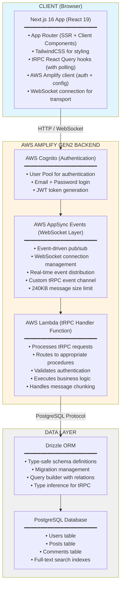
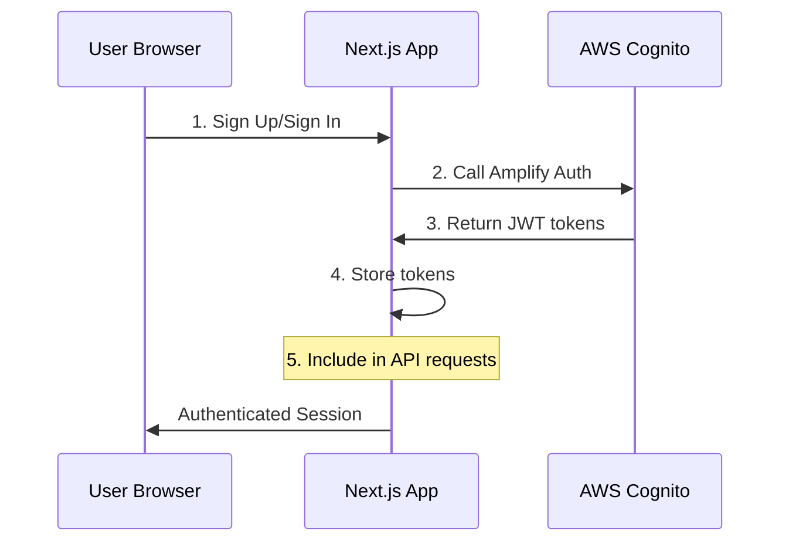
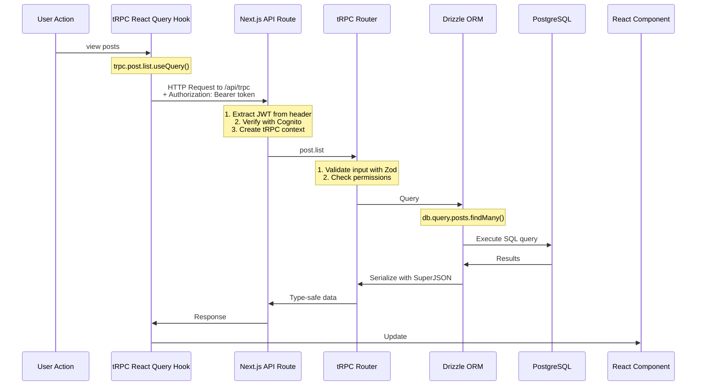
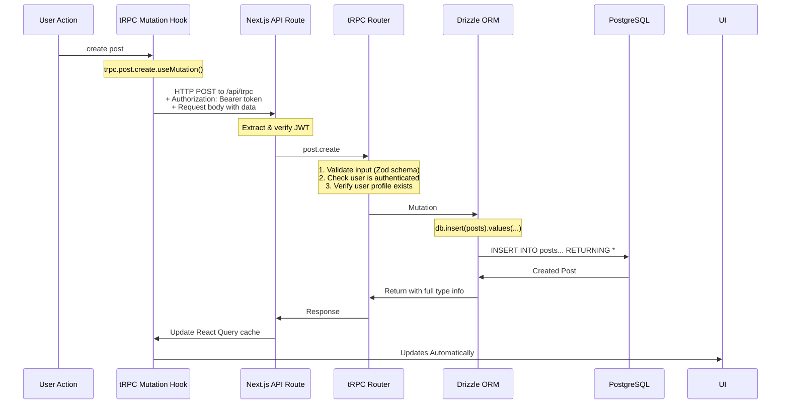
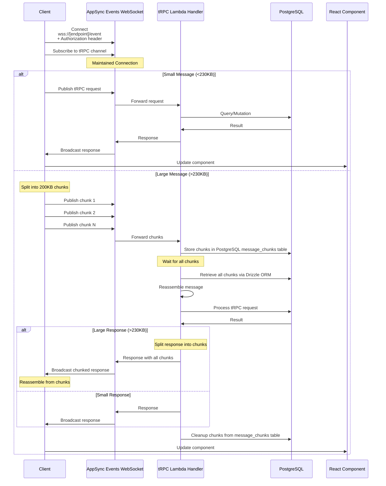
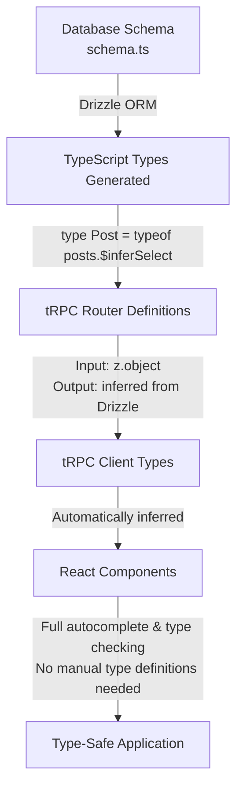
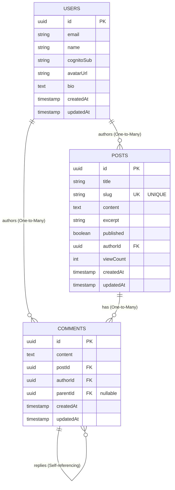
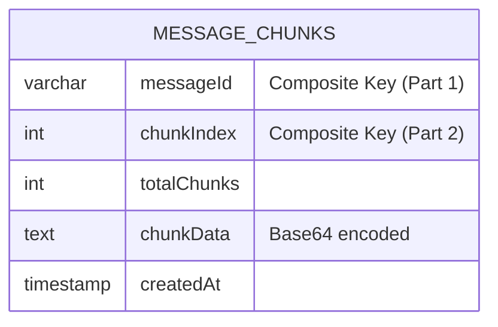

# Architecture Overview

## System Architecture

## Request Flow

### 1. Authentication Flow

### 2. Query Flow (Read Operations)

### 3. Mutation Flow (Write Operations)

### 4. WebSocket Flow (tRPC over AppSync Events)

## Type Safety Flow

## Data Model

### Application Schema (Drizzle ORM)

### Message Chunking Schema (PostgreSQL)

## Security Layers

### 1. Network Security
- HTTPS/WSS encryption for all traffic
- VPC for database (optional)
- Security groups for AWS resources

### 2. Authentication
- AWS Cognito JWT tokens
- Token validation on every request
- Automatic token refresh
## Scalability Considerations

### Horizontal Scaling
- **Lambda**: Automatically scales to handle requests
- **Next.js**: Can be deployed with AWS Amplify Hosting or other providers
- **Database**: Add read replicas for queries; chunk storage uses same PostgreSQL instance

### Vertical Scaling
- **Database**: Upgrade instance size as needed
- **Lambda**: Increase memory allocation (increases CPU)

### Caching Strategy
- **React Query**: Client-side caching (5s stale time)
- **CDN**: Static assets cached at edge
- **Database**: Add Redis for frequently accessed data
- **Message Chunks**: Client-side ChunkStore with 1-minute timeout

### Connection Pooling
- **Drizzle**: Reuse connections in Lambda
- **PgBouncer**: Pool connections to PostgreSQL

### Message Size Optimization
- **Chunking**: Transparent 200KB chunking for messages >230KB
- **DynamoDB Storage**: Temporary chunk storage with TTL cleanup
- **Base64 Encoding**: Safe transmission with ~33% size overhead
- **Best Practices**: Use pagination and field selection to minimize payload sizes
- **Lambda**: Automatically scales to handle requests
- **Next.js**: Can be deployed with AWS Amplify Hosting or other providers
- **Database**: Add read replicas for queries

### Vertical Scaling
- **Database**: Upgrade instance size as needed
- **Lambda**: Increase memory allocation (increases CPU)

### Caching Strategy
- **React Query**: Client-side caching (5s stale time)
- **CDN**: Static assets cached at edge
- **Database**: Add Redis for frequently accessed data

### Connection Pooling
- **Drizzle**: Reuse connections in Lambda
- **PgBouncer**: Pool connections to PostgreSQL

## Monitoring & Observability

### AWS CloudWatch
- Lambda execution logs
- Error tracking and alarms
- Performance metrics

### Application Metrics
- Request latency
## Cost Structure

### Variable Costs (Per Request)
- Lambda invocations: $0.0000002 per request
- Lambda duration: $0.0000166667 per GB-second
- Database queries: Included in database cost (includes chunk storage)
- AppSync Events: $2.40 per million messages + $0.08 per million connection minutes

### Fixed Costs (Monthly)
- Database: $15-100 depending on size (includes chunk storage)
- AWS Amplify Hosting: Free tier available, then ~$0.01/build minute + $0.15/GB stored
- Cognito: Free tier covers most use cases (50,000 MAUs)

### Optimization Tips
- Use database indexes for fast queries
- Minimize Lambda cold starts
- Cache frequently accessed data
- Use Amplify free tier resources
- **Chunking optimization**: Minimize large payloads to reduce PostgreSQL write/read operations
- **Pagination**: Use pagination instead of large result sets to avoid chunking overhead
- **Cleanup job**: Periodic cleanup of old chunks (>1 hour) via scheduled task prevents storage bloat

## Deployment Environments

### Development
## Technology Choices - Rationale

### Next.js 16
- Industry standard for React SSR
- Excellent developer experience
- Built-in API routes
- Great performance

### tRPC
- End-to-end type safety
- No code generation needed
- Minimal boilerplate
- Excellent DX

### Drizzle ORM
- Type-safe schema definitions
- Zero runtime overhead
- Great migration system
- SQL-like query builder

### AWS Amplify Gen2
- Simplified cloud development
- Infrastructure as code
- Integrated auth & API
- Great for startups/MVPs

### PostgreSQL
- Robust and reliable
- Rich feature set
- Great ecosystem
- Scalable

### AppSync Events API
- WebSocket-based persistent communication layer
- Integrated with Cognito authentication
- Event-driven pub/sub architecture
- Built-in connection management
- **Client Strategy**: Uses React Query polling over WebSocket for efficient data fetching
- **Note**: 240KB message size limit handled via transparent PostgreSQL-based chunking

### PostgreSQL for Chunking
- Uses existing database infrastructure (no DynamoDB needed)
- No additional services or costs required
- Simple `message_chunks` table managed with Drizzle ORM
- Fast read/write operations with minimal latency (~5-20ms per chunk)
- Automatic cleanup after processing, with periodic background jobs for orphaned chunks

## Message Chunking System

### Architecture Decision
To handle AppSync Events API's 240KB message size limit, a transparent chunking system has been implemented:

#### Client-Side (`src/lib/trpc/appsync-ws-link.ts`)
- Detects messages >230KB before sending
- Splits into 200KB base64-encoded chunks
- Sends chunks sequentially via WebSocket
- Reassembles incoming chunked responses using in-memory `ChunkStore`
- 1-minute timeout for incomplete messages

#### Server-Side (`amplify/events/handler.ts`)
- Receives chunks and stores in PostgreSQL `message_chunks` table using Drizzle ORM
- Waits for all chunks to arrive before processing
- Reassembles complete message from stored chunks
- Processes tRPC request normally
- Chunks large responses if needed (>230KB)
- Cleans up chunks from PostgreSQL after processing to prevent orphaned data

#### Shared Utilities
- **Client**: `src/lib/trpc/chunking-utils.ts` (browser-compatible)
- **Server**: `amplify/events/chunking-utils.ts` (Node.js with Drizzle ORM)

#### Key Features
- ✅ **Transparent**: No application code changes needed
- ✅ **Bidirectional**: Works for requests and responses
- ✅ **Automatic Cleanup**: Periodic cleanup job removes old chunks
- ✅ **Error Handling**: Cleanup on errors and timeouts
- ✅ **Zero Overhead**: Small messages (<230KB) sent normally
- ✅ **Single Database**: Uses same PostgreSQL instance, no additional infrastructure

#### Performance Impact
- Small messages: Zero overhead
- Large messages: ~33% size increase (base64) + PostgreSQL insert/query latency (~5-20ms per chunk)
- Best practice: Use pagination to avoid large payloads

#### Monitoring
- CloudWatch logs track chunking events
- PostgreSQL query logs show chunk storage operations
- Client console logs show chunking activity

See `CHUNKING.md`, `CHUNKING_SUMMARY.md`, and `CHUNKING_QUICKSTART.md` for detailed documentation.

This architecture provides a solid foundation for a production-ready blog platform with room to grow.

### AWS Amplify Gen2
- Simplified cloud development
- Infrastructure as code
- Integrated auth & API
- Great for startups/MVPs

### PostgreSQL
- Robust and reliable
- Rich feature set
- Great ecosystem
- Scalable

This architecture provides a solid foundation for a production-ready blog platform with room to grow.
